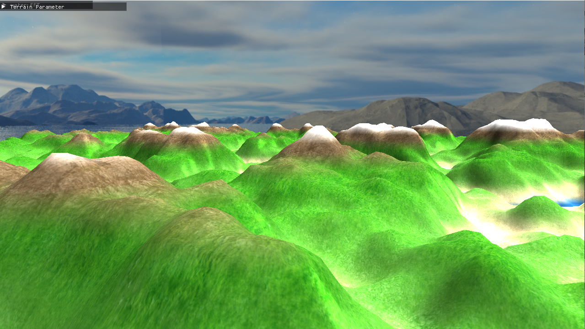
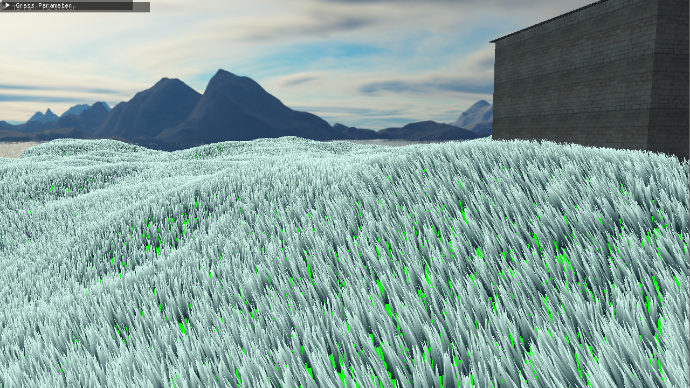
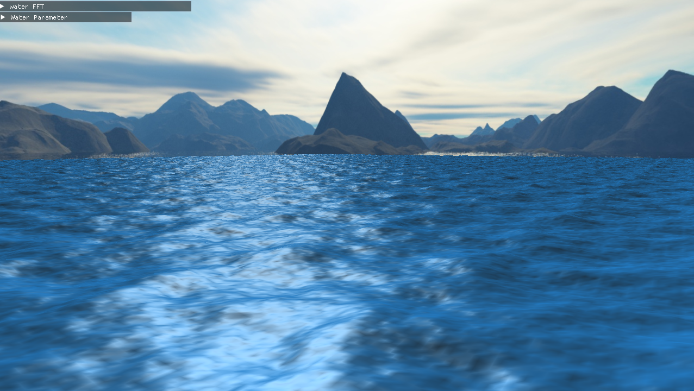
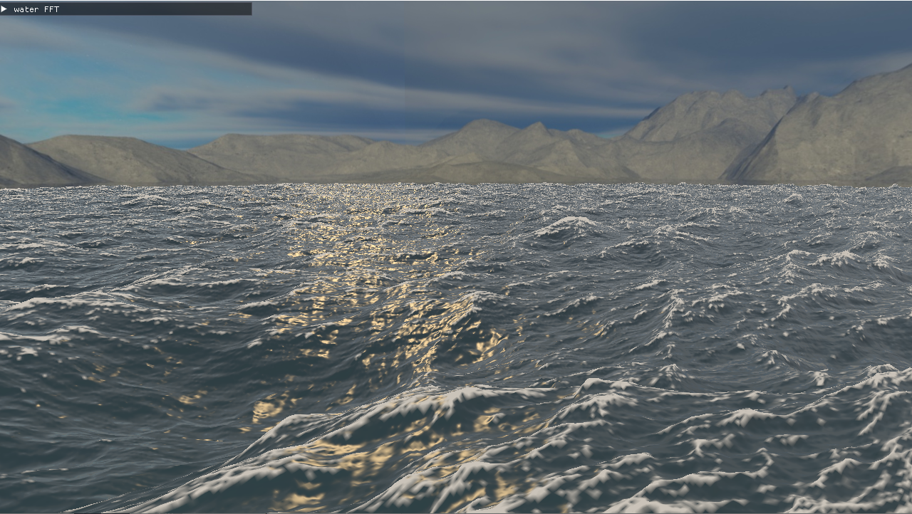
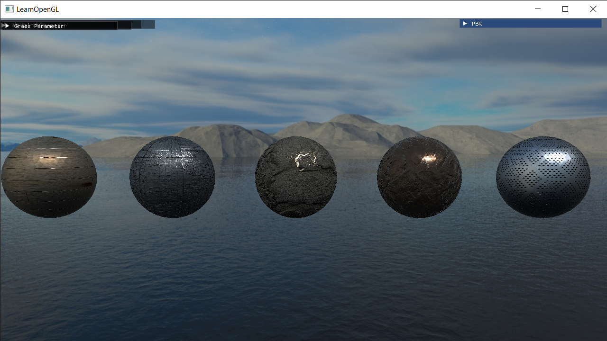
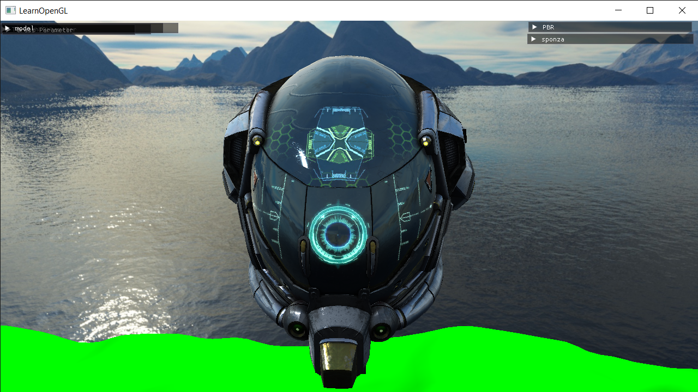
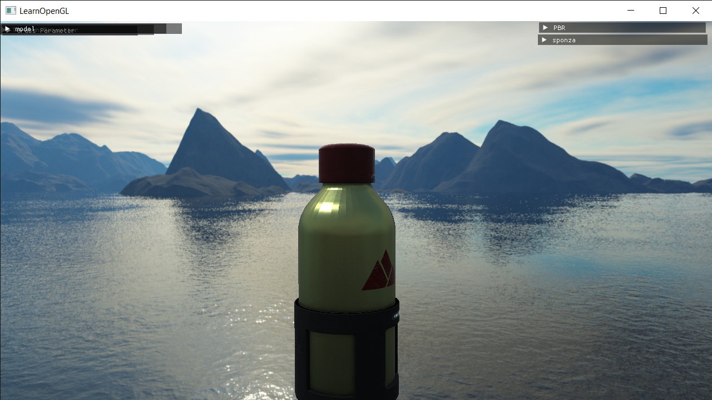
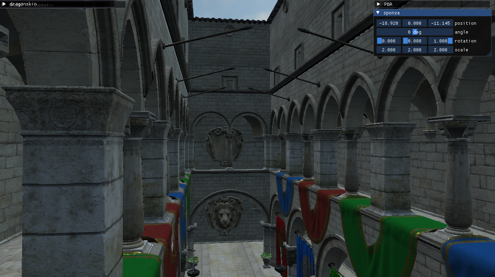

## About
A modern OpenGL Engine written in C++. The purpose about this project, primarily a playground for me to learn and implement different graphics programming techniques or/and physics engine game.

## Library
1. [`OpenGL/GLAD`](https://glad.dav1d.de/) - Allows for drawing of graphics via the GPU
2. [`GLFW`](https://www.glfw.org/) - For creating the window and handling OS-specific operations
3. [`glm`](https://github.com/g-truc/glm) - mathematics library for OpenGL Shading Language (GLSL) specification.
4. [`ImGui`](https://github.com/ocornut/imgui) - For graphical user interfaces (GUIs) for development and debugging tools
5. [`tinyGLTF`](https://github.com/syoyo/tinygltf) - For parsing and loading glTF 3D models

## How to run
The only way to run this project, download and install [`visual studio 2022`](https://visualstudio.microsoft.com/vs/). Clone or download this project, then open the .sln file (OpenGL-Engine.sln).
it will open visual stdio, then build and run the project or just by click local windows Debuggers.

## Current Features
1. Terrain Generation

   simple terrain generation with perlin noise for height map
   
   
3. grass on terrain
   
   
4. wave ocean simulation (sine wave and FFT)

   sine waves + blind-phong lighting
   '
   
   Wave Ocean use spectrum and FFT
  
6. PBR, BRDF and IBL
   
7. load gltf Model
   
   
   
8. play model animation
   
   https://github.com/user-attachments/assets/a05a1b30-f211-4552-b9ee-e554d008867b

   credit to: https://sketchfab.com/3d-models/monster-skull-hight-poly-05746a785fc641c2b48e59975663cf93
   
   https://github.com/user-attachments/assets/0733f9a5-ce67-4a6d-91fe-b7c0d26f659f
   
   credit to: https://sketchfab.com/3d-models/silver-dragonkin-mir4-89ead4e87cdc4b70840f748383f0998f
## Future Progress
1. ray tracing
2. global illumination
3. fluid simulation
4. ray marching
5. smoke and fog
6. HDR or tonemapping
7. bloom
8. cloth simulation
9. collision detection
10. smooth step for transition animation
11. procedural animation

## References
- https://www.youtube.com/watch?v=wbpMiKiSKm8&list=PLFt_AvWsXl0eBW2EiBtl_sxmDtSgZBxB3
- https://adrianb.io/2014/08/09/perlinnoise.html
- https://www.youtube.com/watch?v=jw00MbIJcrk
- https://www.youtube.com/watch?v=PH9q0HNBjT4
- https://www.youtube.com/watch?v=yPfagLeUa7k
- https://people.computing.clemson.edu/~jtessen/reports/papers_files/coursenotes2004.pdf
- https://www.cg.tuwien.ac.at/research/publications/2018/GAMPER-2018-OSG/GAMPER-2018-OSG-thesis.pdf
- https://gpuopen.com/gdc-presentations/2019/gdc-2019-agtd6-interactive-water-simulation-in-atlas.pdf
- https://www.youtube.com/watch?v=KkOkx0FiHDA
- https://learnopengl.com/PBR/Theory
- https://registry.khronos.org/glTF/specs/2.0/glTF-2.0.html
- https://www.youtube.com/watch?v=f3Cr8Yx3GGA
- https://www.youtube.com/watch?v=ZzMnu3v_MOw
